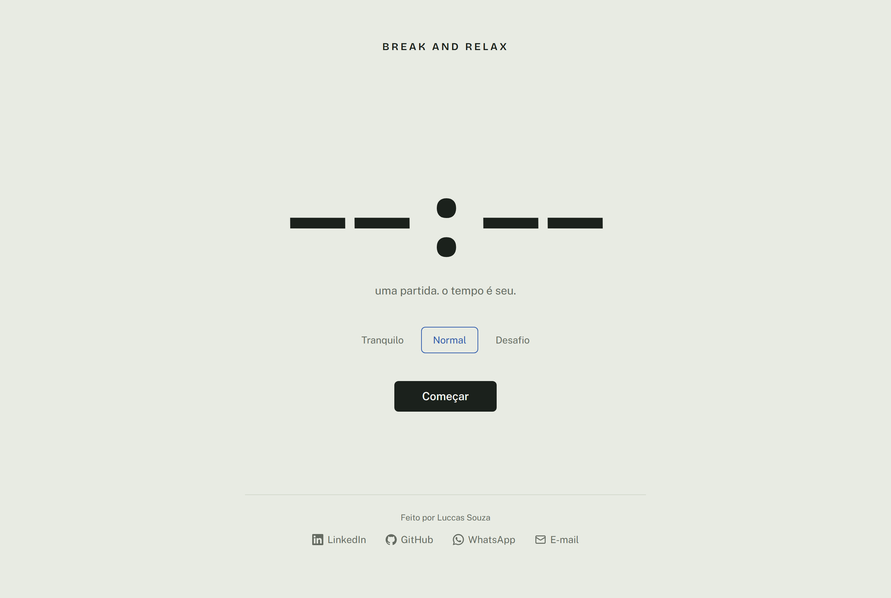
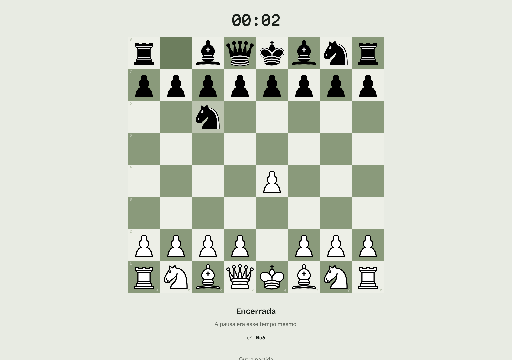

# Break And Relax

Um site de uma página onde alguém que está há horas trabalhando joga **uma** partida contra a máquina — xadrez ou damas —, entende como ela terminou, e volta ao trabalho. A ideia que governa o produto é simples: não queremos que você fique aqui, queremos que você faça uma pausa e volte melhor. O limite não é um cronômetro, é a partida acabar. Sem cadastro, sem ranking, sem streak, sem notificação, sem anúncio.

O relógio é o elemento central da página justamente por não mandar em nada: abre mostrando `--:--`, some por completo durante o jogo, e volta no fim contando de `00:00` até quanto a pausa levou — quando isso já não importa mais.

## Site

https://luccas-souza7.github.io/break-and-relax/

## Tela de início



## Quem perdeu precisa entender por quê

A tela de fim é o oposto de um "você perdeu". O tabuleiro **fica exatamente onde estava, em 100% de opacidade**, as casas que decidiram a partida acendem, e a explicação aparece embaixo — com as casas e as peças reais, nunca um texto genérico.



Três tipos de destaque: **decisivo** (vinho) responde "por que acabou"; **atacante** (azul) é quem executou; **bloqueado** (hachurado) são as casas para onde o rei não podia ir — é isso que faz um mate ou um afogamento fazer sentido de olhar.

## Stack

- Vite + React 18 + TypeScript
- Tailwind CSS v4 (plugin oficial do Vite)
- chess.js — todas as regras do xadrez
- Motor próprio: minimax com poda alfa-beta em Web Worker, um por jogo
- GSAP (core) para a sequência de animação
- shadcn/ui (`button`, `dialog`, `tooltip`) e lucide-react
- Fontes auto-hospedadas via Fontsource: Bricolage Grotesque, Public Sans, Martian Mono
- `vite-plugin-pwa` só para precache — sem manifesto, sem prompt de instalação
- Deploy estático via GitHub Actions para GitHub Pages

Não há backend, banco, API em runtime nem CDN.

## Arquitetura: uma casca, dois jogos

O que sustenta este repositório não são os jogos, é a separação entre eles e a casca.

`src/shell/` renderiza as telas, cronometra, conversa com o worker e escreve o desfecho **sem saber que jogo está rodando**. Tudo chega por um contrato em [`src/types.ts`](src/types.ts):

```ts
interface Jogo<Estado, Lance> {
  id: 'xadrez' | 'damas'
  nome: string
  criarEstado(): Estado
  lancesLegais(e: Estado): Lance[]
  aplicar(e: Estado, l: Lance): Estado
  encerrar(e: Estado): Estado
  vezDe(e: Estado): 'humano' | 'maquina'
  avaliarFim(e: Estado): Desfecho | null   // null = em andamento
  serializar(e: Estado): unknown           // o que o worker precisa ver
  desserializarLance(e: Estado, bruto: unknown): Lance | null
  Tabuleiro: ComponentType<PropsTabuleiro<Estado, Lance>>
  Lateral?: ComponentType<PropsLateral<Estado>>
  criarWorker(): Worker
}
```

Consequências que valem mais que o diagrama:

- **Nada em `src/shell/` importa `src/games/*/rules.ts`.** A única menção a `src/games/` na casca é o `import()` dinâmico que carrega um jogo.
- **Selecionar peça e escolher a promoção são do jogo.** A casca recebe um lance pronto e nunca aprende o que é uma promoção.
- **O `Desfecho` já chega escrito.** Título, explicação e casas para destacar vêm prontos — a casca não sabe o que é um rei.
- **Um worker por jogo**, criado quando a partida começa e `terminate()` ao sair.
- **Carregamento sob demanda.** Abrir o site e jogar xadrez não baixa o código de damas.

## Como os motores funcionam

`src/engine/minimax.ts` é genérico e serve xadrez e damas: minimax em forma negamax com poda alfa-beta, ordenação de lances, aprofundamento iterativo e teto rígido de tempo — quando o tempo acaba no meio de uma iteração, a iteração inteira é descartada e a resposta vem da última profundidade que terminou de verdade.

Ele recebe `fazer`/`desfazer` sobre uma posição mutável, não um `aplicar` imutável. Isso é deliberado: o chess.js leva cerca de 70 µs para gerar os lances de uma posição, e clonar a posição a cada nó custaria mais que a própria busca.

| Jogo | Tranquilo | Normal | Desafio | Teto por lance |
|---|---|---|---|---|
| Xadrez | prof. 1, sorteia entre os 3 melhores | prof. até 3 | prof. até 4 + quiescência | 600 / 600 / 1000 ms |
| Damas | prof. 4, sorteia entre os 3 melhores | prof. 6 | prof. 8 | 600 / 600 / 1000 ms |

Damas comporta profundidade muito maior que xadrez com o mesmo orçamento porque a captura obrigatória corta o fator de ramificação de forma agressiva.

A resposta da máquina é sempre segurada por no mínimo 350 ms nos dois jogos: resposta instantânea parece bug e quebra o ritmo da pausa.

**Por que Web Worker** — a busca do Desafio no xadrez consome perto de um segundo de CPU por lance. Na thread principal isso congelaria a interface. Como o GitHub Pages não permite configurar `Cross-Origin-Opener-Policy` e `Cross-Origin-Embedder-Policy`, nada aqui depende de `SharedArrayBuffer`.

**Uma nota sobre o chess.js** ([`internoChessJs.ts`](src/games/xadrez/internoChessJs.ts)) — as regras vêm inteiramente do chess.js, mas a busca não usa a API pública `moves({ verbose: true })`. Cada objeto `Move` que ela devolve regenera a lista completa de lances legais para desambiguar o SAN e serializa dois FENs. Medido numa posição de meio-jogo, isso dá cerca de 3000 µs por chamada contra cerca de 70 µs do gerador que está por baixo — 40 vezes mais caro, o que inviabiliza qualquer busca real. Nenhuma regra é reimplementada; o que se evita é a formatação que uma busca nunca lê.

## Regras implementadas

### Damas (brasileiras)

Escritas do zero em [`src/games/damas/rules.ts`](src/games/damas/rules.ts), sem biblioteca. As quatro que decidem partidas:

1. **Captura é obrigatória** — havendo captura, nenhum lance simples é legal.
2. **Lei da maioria** — entre as sequências possíveis, é obrigatório escolher a que captura mais peças. Empate na quantidade, escolha livre. Sem lei da qualidade e sem sopro.
3. **Promoção só ao terminar** na última fileira. Uma pedra que apenas *passa* por ela no meio de uma captura continua pedra.
4. **Dama voa**: anda e captura à distância, pousando em qualquer casa livre depois da peça capturada. Nunca se saltam duas peças coladas, e as capturadas só saem do tabuleiro no fim da sequência — até lá elas ainda bloqueiam.

Na interface, uma captura múltipla é percorrida **um salto por vez**: a peça fica selecionada e só o próximo destino acende.

## Como rodar local

```bash
npm i
```

```bash
npm run dev
```

Para conferir a build de produção:

```bash
npm run preview
```

## Peças de xadrez

O conjunto é o **Cburnett**, de Colin M. L. Burnett, distribuído sob [CC BY-SA 3.0](https://creativecommons.org/licenses/by-sa/3.0/). Os arquivos estão em `src/assets/pieces/`, sem modificações. É o mesmo conjunto usado pelo Lichess. As peças de damas são desenhadas em SVG/CSS na paleta do projeto.

## Licença

MIT — veja [LICENSE](LICENSE). A licença cobre o código deste repositório; as peças Cburnett seguem sob CC BY-SA 3.0, como indicado acima.

## Contato

- LinkedIn — https://www.linkedin.com/in/luccas-souza7/
- GitHub — https://github.com/luccas-souza7
- WhatsApp — https://wa.me/5511932018859
- E-mail — luccasnsouza1@gmail.com
